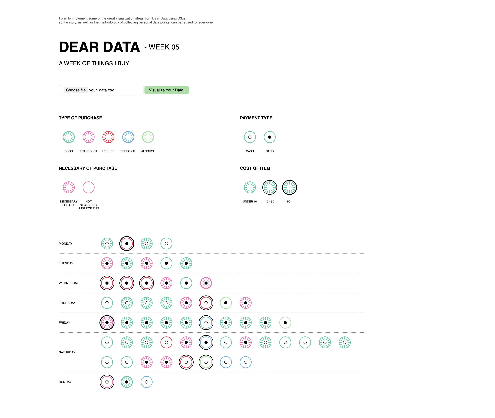
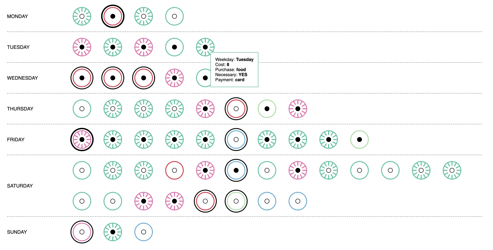
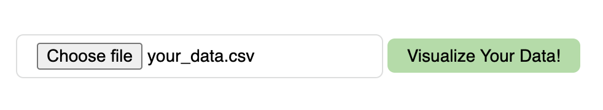
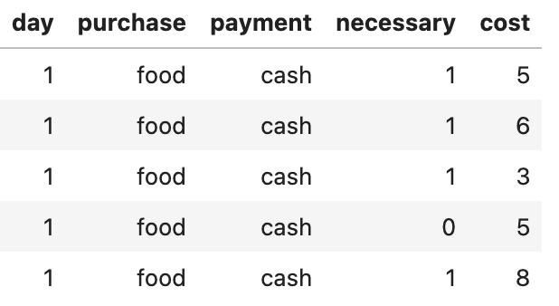
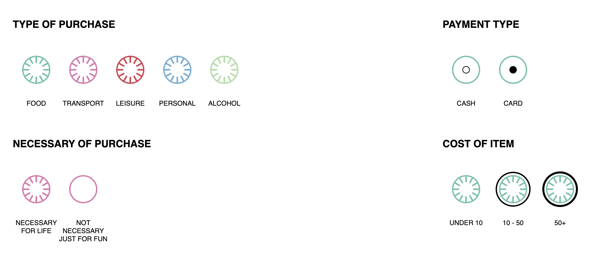

# A Week Of Things I Buy
Dear Data - Week 5

### D3 implementation

#### Overall visual

#### Hover the icon for more details

#### Visualize your own data!

The data should be formated like this: (check the **data** folder for more details!)

Each field of the csv is actually corresponding to a specific style of the icon. 

So the possible values for each field are:

- **day**: 1-7, means Monday to Sunday
- **purchase**: food, transport, leisure, personal, alcohol
- **payment**: card, cash
- **necessary**: 0, 1
- **cost**: any number

### original postcard

Scan from the original Book.

