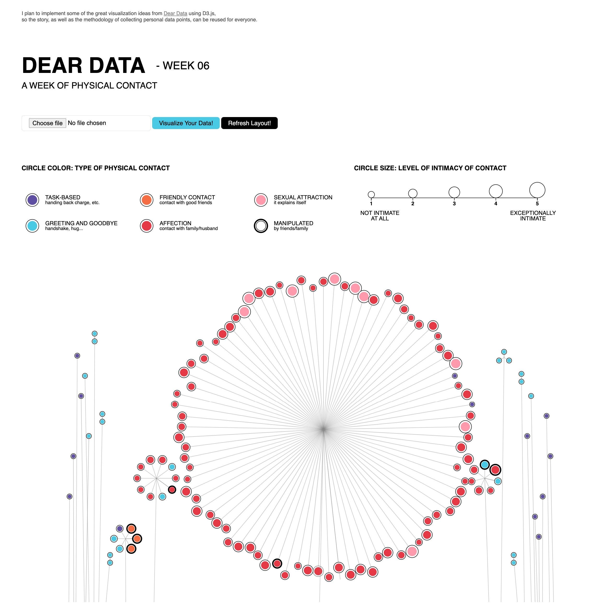
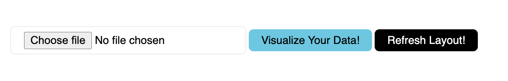
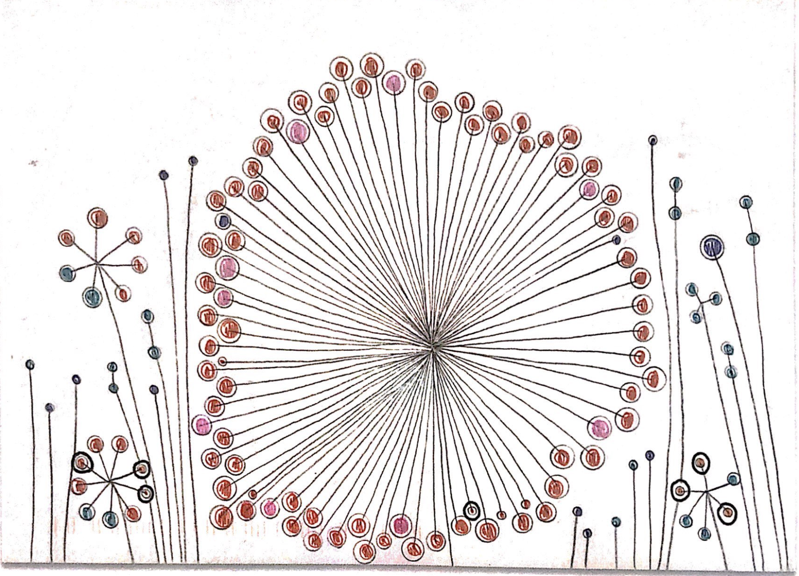

# A Week Of Physical Contact
Dear Data - Week 6

### D3 implementation

#### Overall visual

#### Hover the icon for more details

#### Visualize your own data or Refresh and Update current layout!

The data should be formated like this: (check the **data** folder for more details!)

So the possible values for each field are:

- **person**: with whom you have the physical contacts
- **day**: 1-7, means Monday to Sunday
- **contact**: contact type, can be one of:
	- affection
	- friendly contact
	- greeting and goodbye
	- sexual attraction
	- task-based
- **intimacy**: the level of intimacy, 1-5
- **manipulate**: whether the data has been manipulated, 0 or 1

### original postcard

