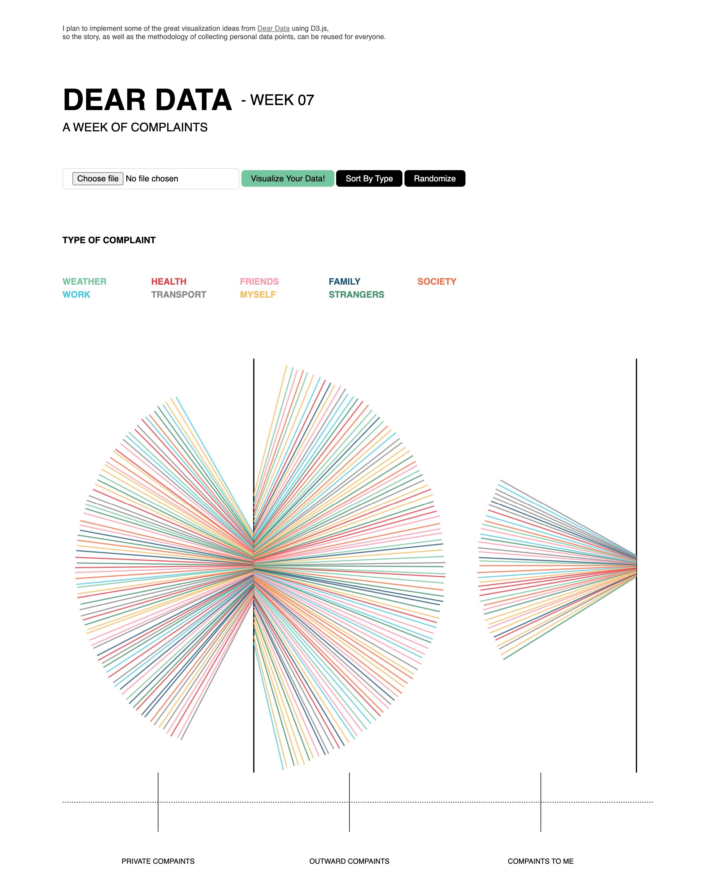
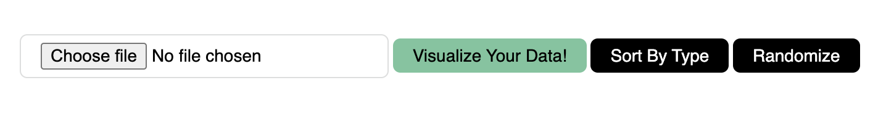
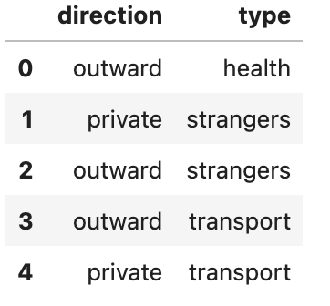
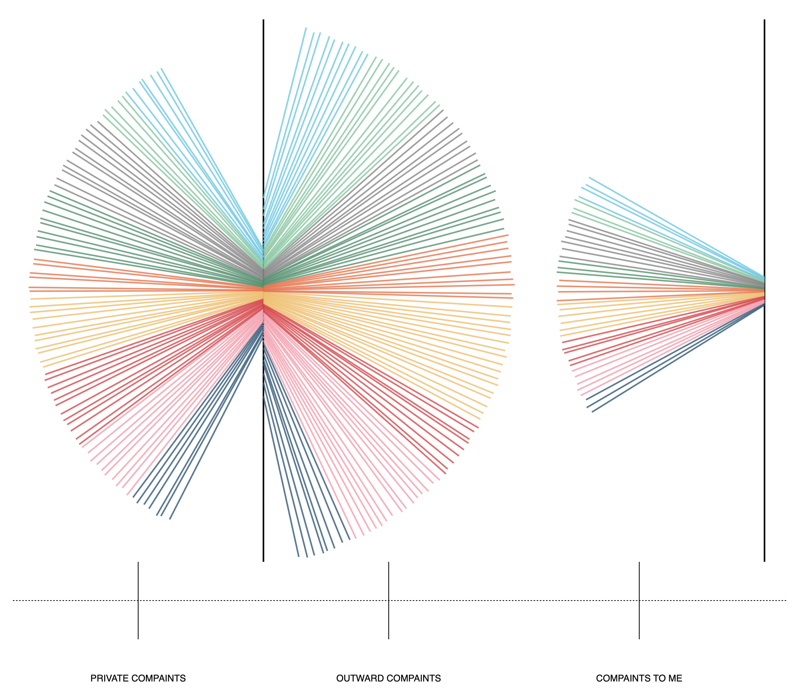
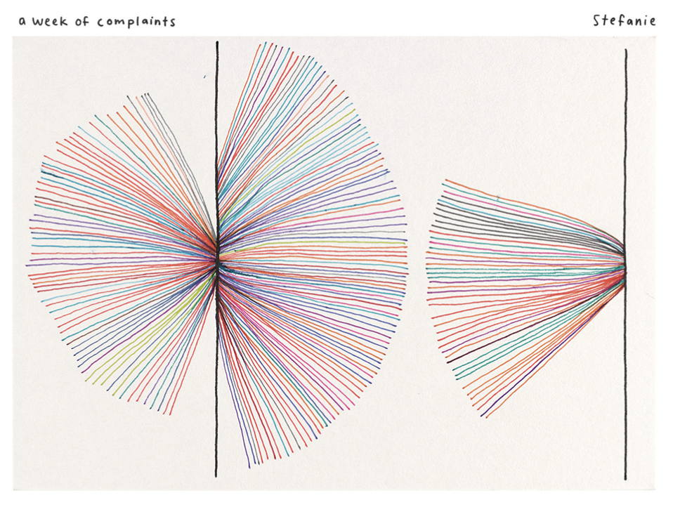

# A Week Of Complaints
Dear Data - Week 7

### D3 implementation

#### Overall visual

#### Hover the icon for more details

#### Visualize your own data!

The data should be formated like this: (check the **data** folder for more details!)

So the possible values for each field are:

- **direction**: private, outward, to_me
- **type**: weather, health, friends, family, society, work, transport, myself, strangers

#### Sort data

By clicking the black buttons!

| Sort By Type                         | Randomize                         |
| ------------------------------------ | --------------------------------- |
|  |  |

### original postcard

Screenshot from [the project website](http://www.dear-data.com/theproject).

